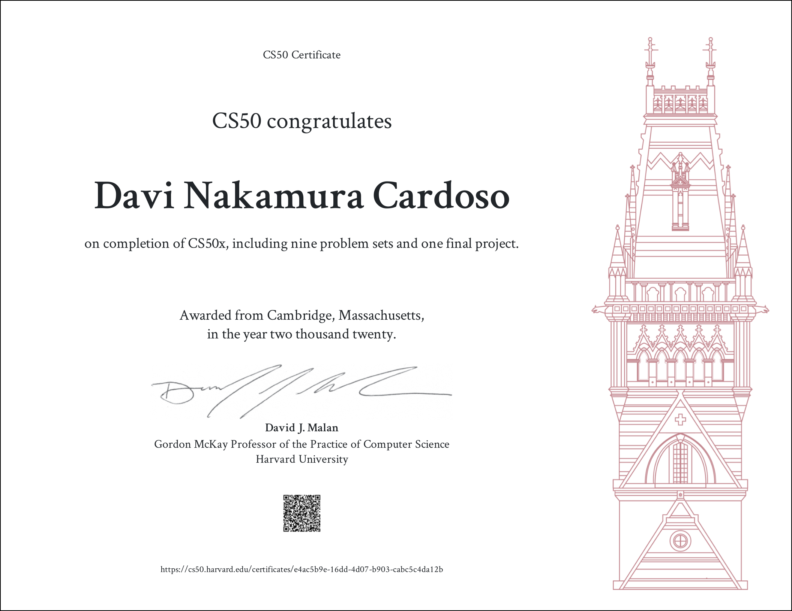

# Harvard-CS50

 Curso de Harvard de Introdução à Ciência da Computação.

Link do certificado: https://certificates.cs50.io/e4ac5b9e-16dd-4d07-b903-cabc5c4da12b.pdf?size=letter

## Semana 0: Introdução

- Definição de ciência da computação
- Representações por meio de dados binários
- Conceitos de bit, byte e processamento por *transistors*
- Definição e estrutura de algoritmos e pseudocódigo
- Funções, Booleanos, condições, loops, variáveis

## Semana 1: Linguagem C

- Primeiro programa escrito em C
- Função *printf*, uso de placeholders e quebras de linha (\n)
- Compilando programas com clang -o 
- Obtenção de input
- Condições *if*, *else if* e *else*
- Loops *while*, *do while* e *for*
- Tipos de dados: *bool*, *char*, *string*, *int*, *unsigned int*, *long*, *float* e *double*
- Operadores matemáticos: **+, -, *, /, ^ e %**
- Definindo funções
- Imprecisões

## Semana 2: Debugging e Arrays

- Bugs de sintaxe, runtime e semântica
- Debugging com GNU Debugger (GDB)
- Memória e RAM
- Conceito de *array*
- Definindo uma *array* em C
- Iteração com o loop *for*
- *Arrays* numéricas e de *strings*
- Introdução à criptografia
- Argumentos *int argc* e *string argv*

## Semana 3: Algoritmos

- Tempo de execução com *Big O: O(n&sup2;), O(n log n), O(n), O(log n), O(1)*
- Tempo de execução com *Big &Omega;: &Omega;(n&sup2;), &Omega;(n log n), &Omega;(n), &Omega;(n log n), &Omega;(1)*
- Busca linear (*Linear search*)
- Busca binária (*Binary search*)
- Bubble sort e suas propriedades *(&Omega;(n), O(n&sup2;))*
- Selection sort e suas propriedades *(&Theta;(n&sup2;))*
- Recursão 
- Insertion sort e suas características *(&Theta;(n&sup2;))*
- Merge sort e suas características *(&Theta;(n log n))*
- Definição de estruturas

## Semana 4: Memória 

- Hexadecimais 

- Pointeiros (*pointers*)
- Alocação de memória dinâmica (*dynamic memory allocation*)
- Usando as funções *malloc* e *realloc*
- Copiando e invertendo valores de strings
- *Heaps* e *stacks*
- Obtenção de input com *scanf*
- Funções *fopen*, *fread*, *fwrite*, *fgetc* e *fputc*
- Manipulação de imagens 
- Recuperação de arquivos

## Semana 5: Estruturas de Dados

- Redefinindo tamanho de *arrays* com *realloc*

- Definição, propriedades e construção das seguintes estruturas de dados:

  - *Linked Lists*

  - *Tree*s

  - *Hash tables* (e *hash functions*)

  - *Tries*

- Definição e características das seguintes estrururas abstratas de dados:

  - *Queues*
  - *Stacks*
  - Dicionários

## Semana 6: Python 

- Conceitos básicos: função *print*, declaração *if*, loops *while* e *for*
- Tipos de dados: *strings*, booleanos, inteiros, *floats* e *Nonetype*
- Estruturas de dados: *list*, *set*, *dictionary*, *range* e *tuple*
- Definindo funções
- Obtenção de input com a função *input()*
- Lendo argumentos da linha de comando com *sys.argv*
- Métodos *upper*, *lower* e*append*
- Funções *len* e *sort*
- Expressões Regulares
- Implementação de Inteligência Artificial para reconhecimento facial e reconhecimento de voz a partir de bibliotecas de código aberto

## Semana 7: SQL

- Problemas de uma base de dados em CSV
- Manipulação de uma Base de Dados com **SQLite3**
- Criando *tables*
- Importando dados para uma base de dados com Python
- Comandos SELECT, UPDATE, DELETE
- Comandos WHERE, ORDER BY e LIMIT
- Selecionando dados de múltiplas *tables* com JOIN

## Semana 8: Informação

- Revisão dos conceitos aprendidos
- Ética na programação:
  - Senhas
  - Cookies
  - Uso impróprio de fotos e vídeos
- Apresentação dos projetos (*Choose your track*):
  - Games (com Lua)
  - Mobile
    - Android (com Java)
    - iOS (com Swift)
  - Web (com HTML, CSS e Python)
- **Projeto Escolhido**: Games

## Projeto Final 1: Pong

### Aula Inicial

- Introdução à linguagem Lua
- Instalação de packages para trabalhar com Lua
- Instalação da *framework* LÖVE
- Instalação de packages para trabalhar com LÖVE

### Pong 0

- O loop dos jogos (*input->update->render*)
- Primeiro programa escrito em Lua
- Métodos *love.load*, *love.draw* e *love.graphics.print*

### Pong 1

- Uso da biblioteca [push](https://github.com/Ulydev/push), de [Ulydev](https://github.com/Ulydev)
- Funções *setDefaultFilter()*, *keypressed()* e *quit()*
- Implementando um tamanho virtual de tela

### Pong 2

- Importando fontes com as funções *love.graphics.newFont* e *love.graphics.setFont*
- Desenhando os retângulos de jogadores com *love.graphics.rectangle*
- Desenhando a bola

### Pong 3

- Implementação do movimento dos *paddles* 
- Uso da função *keyboard.isDown* para verificar o estado das teclas
- Atualizando a posição dos *paddles* com base no *dt (delta time)* desde a última atualização 

### Pong 4

- Limitando o movimento dos *paddles* às extremidades da tela
- Implementando o movimento da bola
- Resetando a posição e velocidade toda vez que a tecla ENTER é pressionada

### Pong 5

- Refatorando o código a partir do uso de classes
- Implementação da biblioteca [class.lua](https://github.com/tenry92/class.lua), de [tenry92](https://github.com/tenry92) 
- Criando a Superclasse (ou classe base) *Block*, com os atributos: *x position, y position, width* e *height*, e o método *render*
- Criando as duas subclasses de *Block*: *Paddle* e *Ball*

### Pong 6

- Exibindo o FPS do jogo na tela com a função implementada do LÖVE *getFPS*
- Mudando o título do jogo para Pong

### Pong 7

- Adicionando um mecanismo de reflexão (*bounce*) da bola ao tocar a parte superior ou inferior
- Adicionando reflexão da bola ao tocar um dos *paddles*
- Implementando a volta da bola ao centro sempre que toca um dos lados da tela

### Pong 8

- Exibição e atualização dos pontos dos jogadores
- Adição do game_state *serve*, em que o jogador, após marcar um ponto, deve lançar novamente a bola

### Pong 9

- Alterando a velocidade da bola ao ser resetada para que ela se direcione sempre ao lado do último jogador a marcar pontos
- Mudança na mensagem exibida a cada estado do jogo (start, serve, play)

### Pong 10

- Checando a quantidade de pontos
- Definindo um número máximo de pontos
- Exibindo o vencedor

### Pong 11

- Adicionando efeitos sonoros ao bater nas bordas, nos *paddles* e aol resetar
- Implementação da funcionalidade Pause, para pausar o jogo

### Pong 12

- Permitindo a redifinição do tamanho da tela

